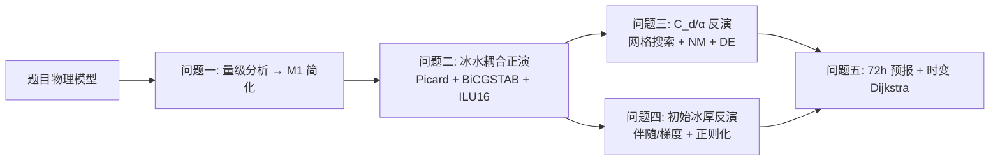

# 北极边缘冰区海冰演化与船舶安全航行建模

2026 研究生集训模拟题（机理分析与仿真类）。完整题目与参数见
[题目原文_整理版](docs/题目原文_整理版.md)，原始 PDF 为
`研究生集训模型1（订正后版本）——北极边缘冰区海冰演化与船舶安全航行建模.pdf`。

## 一、题目一句话

在 20000 m × 10000 m 的北极矩形海域上，用海冰动量方程（VP 黏塑性本构）+ 冰厚平流方程 +
浅水方程（SWE）耦合正演 24 h 冰情演化；再基于稀疏观测反演关键参数与初始场；
最后以反演结果驱动 72 h 冰密集度预报，为 LNG 船设计全局最优航线。

## 二、五个问题与当前状态

| 问题 | 内容 | 状态 |
|---|---|---|
| 问题一 | 海冰动量方程五力量级分析 + M1 简化（删惯性/冰科里奥利） | ✅ 完成 |
| 问题二 | 冰水耦合 24 h 全域正演（100×50 完成，题定 200×100 服务器运行中） | 🔄 进行中 |
| 问题三 | C_d、α 双参数反演（网格搜索/Nelder-Mead/差分进化三法对比） | ✅ 完成 |
| 问题四 | 初始冰厚场反演（物理约束 + 正则化）+ 48 h 预报 | ✅ 完成 |
| 问题五 | 72 h 冰密集度预报 + 时变 Dijkstra 全局航线优化 | ✅ 完成 |

论文：`paper/main.pdf`（2026-08-09 编译，17 页）；正式结果与中间产物见 `output/`。

## 三、技术路线总览



核心物理口径（订正后，全题统一）：

- 内力一律用厚度加权散度 ∇·(hᵢσ)；
- 问题二正式模型 M1：海冰方程删惯性 + 删冰科里奥利（准静力），**海水科里奥利保留**；
- 冰水拖曳双向耦合：τ_wi = ρ_w C_d |u−U|(u−U)。

## 四、仓库结构

```text
.
├── problem2_core/          # 问题二核心求解器（正式代码，冻结）
│   ├── config.py           #   冻结配置（网格/参数/迭代预算/zeta_max）
│   ├── ice_momentum.py     #   M0/M1 海冰动量 Picard 求解器
│   ├── rheology_vp.py      #   VP 黏塑性本构
│   ├── ocean_swe.py        #   海水浅水方程（IMEX）
│   ├── solver.py           #   外层耦合流程
│   ├── runner.py           #   24h 正演运行器
│   ├── multigrid.py        #   多重网格（对照实验，未采用）
│   └── schwarz.py          #   条带 Schwarz（对照实验，未采用）
├── tests/                  # pytest：89 passed
├── scripts/                # 服务器运行器 run_server.py / 状态查看
├── output/                 # 各问题正式结果（JSON/CSV/图）
├── paper/                  # LaTeX 论文
├── docs/                   # 题目整理、思路、交接文档
├── 问题二_正式出图.py        # 问题二结果出图
├── 问题二_Q2R5_网格限制比较.py # 100×50 → 200×100 守恒/网格比较
├── 问题三_参数反演.py        # 问题三 C_d/α 反演
├── 问题四_初始冰厚反演.py     # 问题四初始场反演
├── 问题五_72h预报.py / 问题五_航线优化.py  # 问题五预报与航线
└── 研究生集训模型1（订正后版本）…pdf 等题目/参考材料
```

## 五、快速开始

环境：Python 3.10+，依赖 numpy、scipy、matplotlib（论文编译需 XeLaTeX）。

```bash
# 1) 跑测试
python -m pytest tests -q

# 2) 问题二小网格冒烟（分钟级）
python 问题二_M1_标准网格_第五轮.py --grid 100x50 --mode M1

# 3) 问题二题定 200×100（服务器，12–24 h）
#    脚本：scripts/run_server.py（通用运行器，带进度/ETA/失败标记；
#    另有 scripts/server_status.py 查看服务器进度）
python run_server.py <workspace> 200x100 1e7

# 4) 结果出图
python 问题二_正式出图.py
```

## 六、当前主线：问题二 200×100 收官

详细思路、求解器选型、正则化决策与接手清单见
[问题二_思路与接手指引](docs/问题二_思路与接手指引.md)。
要点速览：

1. **求解器**：每物理步 Picard 定点迭代（预算 100/300/500）+ 内层
   BiCGSTAB + ILU16 预条件 + 受保护 Anderson(3) + 线搜索 + ILU 复用；
2. **收敛卡点**：VP 黏度刚度导致 zeta_max=1e8 时 step 19/117 不收敛；
   正式运行统一改用 **zeta_max=1e7**（100×50 同口径重跑已完成，passed）；
3. **服务器**：192.168.182.155 上 200×100 运行中（日志
   `run_200x100_zeta1e7.log`），预计 2026-08-11 凌晨完成；
4. **完成即做**：下载结果 → `问题二_正式出图.py` → `问题二_Q2R5_网格限制比较.py`；
5. **不进论文**：zeta 敏感性、多重网格/Schwarz 对照仅存档（见
   `问题二_多重网格对比实验记录.md`）。

## 七、队友接手清单（问题二收尾）

- [ ] 确认服务器 200×100 完成（`summary.json` status=passed，288/288 步）
- [ ] 下载 `run_1/`（config.json、summary.json、snapshots.npz）
- [ ] `问题二_正式出图.py` 出 24h 场图、0/6/12/18/24h 冰厚图、中心点时序曲线
- [ ] 核对区域平均冰厚与最大冰速（6 位小数）
- [ ] `问题二_Q2R5_网格限制比较.py` 核对 100×50 → 200×100 守恒限制
- [ ] 论文口径更新（如需），保持 zeta/多重网格内容不进正文
- [ ] 归档服务器日志与失败存档目录，防止误覆盖

## 八、已踩的坑（新人必读）

- 中文路径在 `python -` stdin 会编码报错 → 用独立 `.py` 文件；
- 输出目录已存在即拒跑（防覆盖正式结果），残留 `run_1` 先改名隔离；
- 200×100 单步 400–600 s 属正常，不要误判卡死，看 ETA；
- 服务器无 MKL/pypardiso，只有 numpy/scipy，不要随便 pip install；
- 失败步会写 `RUN_FAILED.txt` + `failures/` 快照，可单步回放诊断。

## 九、参考材料

- `关于题目的部分提示说明.pdf`（题目方提示）
- `必须掌握的五大模型十大算法（适应于研究生）简析_20260713215457.pdf`（方法体系参考）
- `全题主控协作看板.md`（开发过程记录）
- `交接文档_未完成事项与接手指引.md`（最终状态与遗留事项）

## 十、致谢与说明

- 论文含真实文献引用与 AI 工具使用说明（附录 B），提交前请按参赛规定复核；
- 数据附件按题目要求打包提交（`研训188队_数据附件.zip` 为参考格式）。
