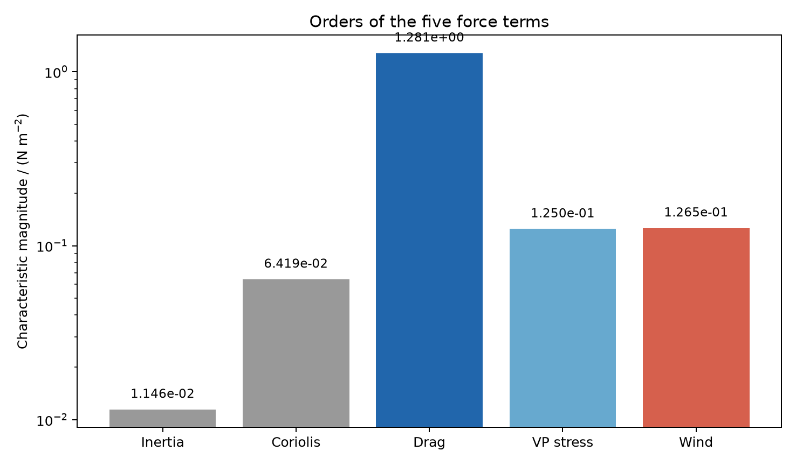
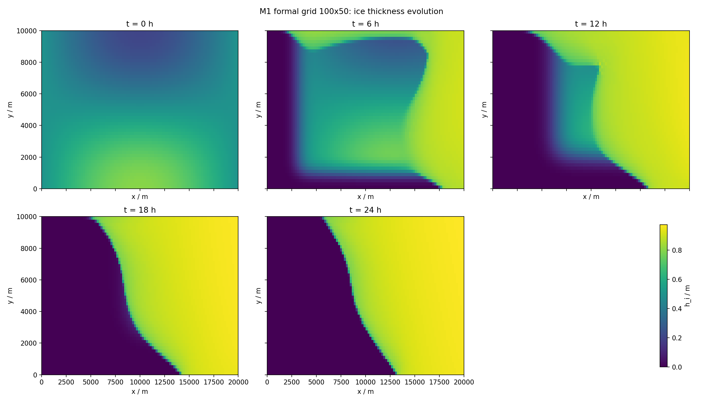
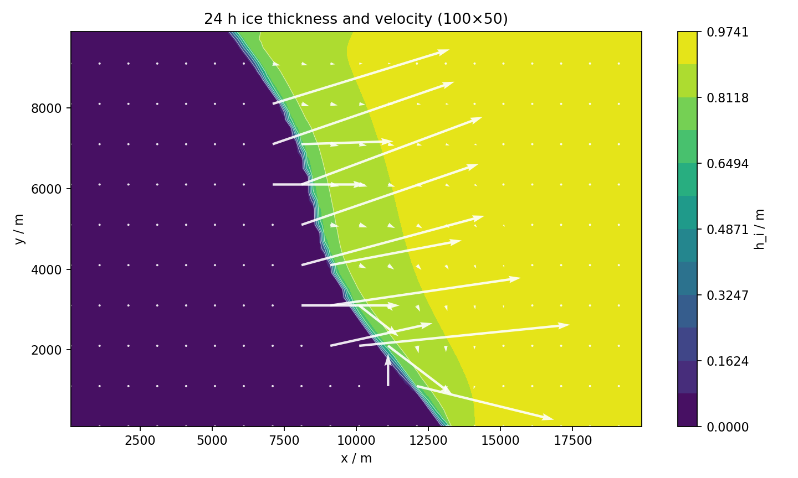
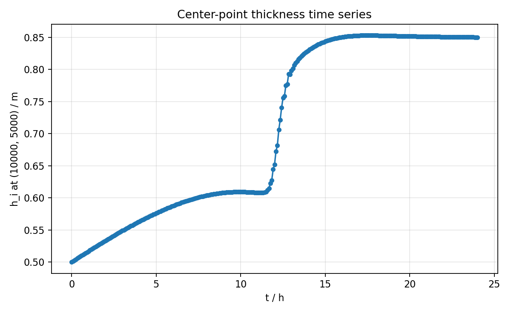
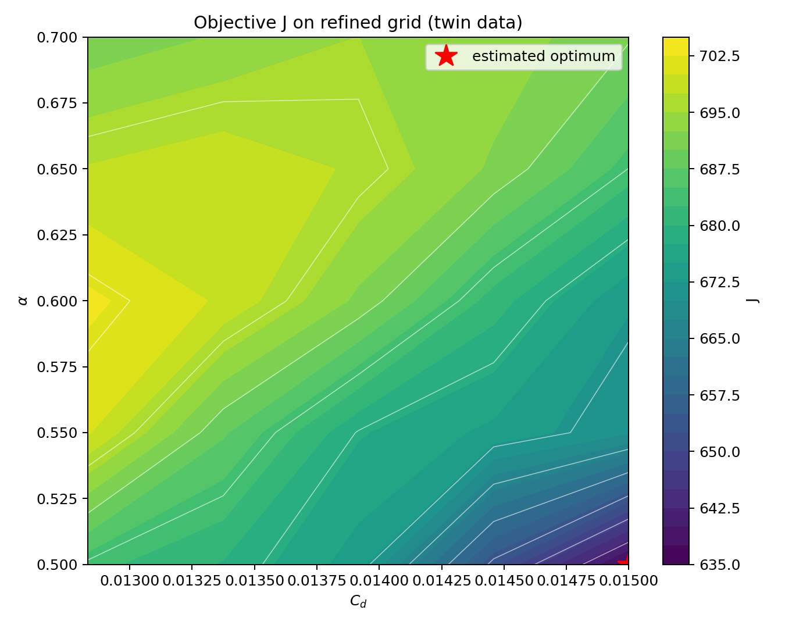
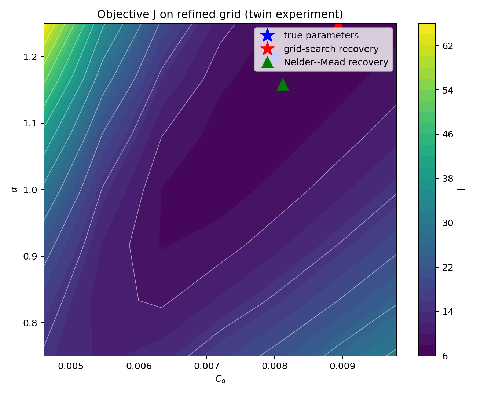
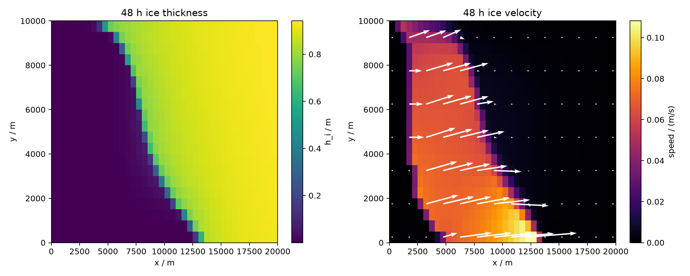
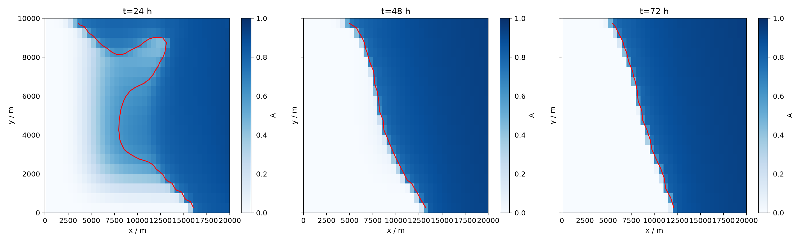
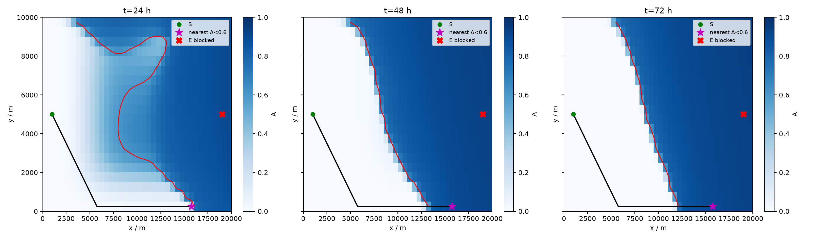

# 北极边缘冰区海冰演化与船舶安全航行建模

## 0. 解题纪律与统一口径

本文严格采用以下顺序：

> 模型选择 → 模型化简 → 算法选择 → 求参与数值求解 → 结果检验

统一物理口径为

$$
\rho_i h_i\frac{D\mathbf U}{Dt}
=-\rho_i h_i f(\mathbf k\times\mathbf U)
+\nabla\cdot(h_i\boldsymbol\sigma)
+\boldsymbol\tau_{wi}
+\boldsymbol\tau_a.
$$

二维内力必须写成 $\nabla\cdot(h_i\boldsymbol\sigma)$，不能写成
$\nabla\cdot\boldsymbol\sigma$，也不能在变冰厚条件下随意改成
$h_i\nabla\cdot\boldsymbol\sigma$。

数值结果分三类报告：

| 类型 | 含义 |
|---|---|
| 本次可复核结果 | 有代码、结构化输出和守恒/残差检查 |
| 教师参考值 | 用于检查数量级，不冒充本次计算 |
| 条件候选 | 优化预算内得到，但未满足严格收敛或位于参数边界 |

---

## 1. 问题一：五项力量级与海冰动量方程化简

### 1.1 模型选择

选择特征尺度分析。题目要求比较的是科学计数法指数，即比较
$10^n$ 中的 $n$，而不是先运行完整模型再根据输出倒推删项。

题定尺度为

$$
L_0=2.0\times10^4\ \mathrm m,\quad
U_0=5.0\times10^{-1}\ \mathrm{m/s},\quad
h_0=1\ \mathrm m,
$$

$$
T_0=\frac{L_0}{U_0}=4.0\times10^4\ \mathrm s.
$$

### 1.2 五项力的特征量值

按单位水平面积上的力统一比较，单位均为 $\mathrm{N/m^2}$。

#### 1.2.1 惯性力

$$
F_I\sim \rho_i h_0\frac{U_0}{T_0}
=917\times1\times\frac{0.5}{4.0\times10^4}
=1.14625\times10^{-2}.
$$

#### 1.2.2 海冰科里奥利力

$$
F_C\sim \rho_i h_0 fU_0
=917\times1\times1.4\times10^{-4}\times0.5
=6.4190\times10^{-2}.
$$

#### 1.2.3 冰水拖曳力

取冰水相对速度特征值 $U_{r0}\sim U_0$，

$$
F_D\sim\rho_w C_dU_{r0}^2
=1025\times0.005\times0.5^2
=1.28125\times10^0.
$$

#### 1.2.4 VP 流变内力

在 $A=1,h_i=h_0$ 时，$P_0=P^*h_0=5000\ \mathrm{Pa}$。按教师参考答案，
用 VP 各向同性压力项 $P_0/2$ 估计应力尺度：

$$
F_\sigma\sim\frac{h_0(P_0/2)}{L_0}
=\frac{1\times2500}{20000}
=1.25\times10^{-1}.
$$

#### 1.2.5 风应力

以矢量模长计，

$$
F_W=\sqrt{0.12^2+0.04^2}
=1.26491\times10^{-1}.
$$

汇总如下：

| 力项 | 特征值 / $\mathrm{N/m^2}$ | 科学计数法量级 |
|---|---:|---:|
| 惯性力 | $1.14625\times10^{-2}$ | $10^{-2}$ |
| 科里奥利力 | $6.4190\times10^{-2}$ | $10^{-2}$ |
| 冰水拖曳力 | $1.28125\times10^0$ | $10^0$ |
| VP 流变内力 | $1.25\times10^{-1}$ | $10^{-1}$ |
| 风应力 | $1.26491\times10^{-1}$ | $10^{-1}$ |

因此量级排序为

$$
F_D(10^0)>F_\sigma(10^{-1})\approx F_W(10^{-1})
\gg F_C(10^{-2})>F_I(10^{-2}).
$$

按题意删除两个 $10^{-2}$ 量级项，保留另外三项。

### 1.3 简化模型

简化后的瞬时三力平衡模型 M1 为

$$
\boxed{
\nabla\cdot(h_i\boldsymbol\sigma)
+\boldsymbol\tau_{wi}
+\boldsymbol\tau_a=0
}.
$$

分量形式为

$$
\frac{\partial(h_i\sigma_{xx})}{\partial x}
+\frac{\partial(h_i\sigma_{xy})}{\partial y}
+\rho_wC_dU_r(u-U)+\tau_{a,x}=0,
$$

$$
\frac{\partial(h_i\sigma_{yx})}{\partial x}
+\frac{\partial(h_i\sigma_{yy})}{\partial y}
+\rho_wC_dU_r(v-V)+\tau_{a,y}=0,
$$

$$
U_r=\sqrt{(u-U)^2+(v-V)^2}.
$$

海水动量方程中的科里奥利力仍然保留；这里只删除海冰动量方程中的科里奥利项。

### 1.4 Picard 子步中的条件闭式关系

VP 应力满足 $\boldsymbol\sigma=\boldsymbol\sigma(\nabla\mathbf U)$，因此完整 M1
仍是关于冰速场的非线性空间方程，不能把内力当作预先已知量并一次闭式求出
$\mathbf U$。在 Picard 迭代的第 $m+1$ 轮中，若先冻结第 $m$ 轮应力，记

$$
\mathbf R^{(m)}
=\nabla\cdot(h_i\boldsymbol\sigma^{(m)})+\boldsymbol\tau_a,
$$

则该子步的拖曳平衡为

$$
\rho_wC_d|\mathbf u-\mathbf U^{(m+1)}|
(\mathbf u-\mathbf U^{(m+1)})=-\mathbf R^{(m)}.
$$

若进一步把 $\mathbf R^{(m)}$ 视为子步内已知向量且非零，可得到条件更新关系

$$
\boxed{
\mathbf U^{(m+1)}
=\mathbf u+\frac{\mathbf R^{(m)}}
{\sqrt{\rho_wC_d|\mathbf R^{(m)}|}}
}.
$$

该式只是冻结内力后的局部 Picard 更新，不是完整 VP 三力平衡的解析闭式解。若
进一步忽略局部内力并取海水静止，则才退化为可独立手算的风--拖曳平衡：

$$
\mathbf U
=\frac{\boldsymbol\tau_a}
{\sqrt{\rho_wC_d|\boldsymbol\tau_a|}}
=(0.149041,\ 0.049680)\ \mathrm{m/s},
$$

$$
|\mathbf U|=0.157102\ \mathrm{m/s}.
$$

该值与教师给出的静水极限 $0.157102\ \mathrm{m/s}$ 一致，是问题二数值解的
基础量级检查。

### 1.5 极端冰情与失效条件

碎冰区 $h_i\to0$ 时，惯性力、科里奥利力为 $O(h_i)$，而
$P=P^*h_i\exp[-20(1-A)]$，厚度加权内力约为
$O(h_i^2e^{-20})$，衰减更快。此时连续冰盖 VP 假设本身也失效，不能因为
两个删项绝对值趋零就认为相对误差仍小。数值上应设置无冰掩膜。

厚冰区若 $A$ 截断为 1，则 $P\propto h_i$，厚度加权内力约为 $O(h_i^2)$，
而惯性、科里奥利力约为 $O(h_i)$。在缓变外力下三力平衡更有依据；但风场突变、
初始速度远离平衡、固壁挤压带和强剪切区仍可能使准静态假设失效。

其他明确失效情形包括：冰水相对速度很小导致拖曳退化、保留三力彼此强抵消、
冰缘裂隙、快速外力变化以及需要解析启动瞬态时。

---

## 2. 问题二：冰水耦合正问题求解

### 2.1 模型选择

使用问题一的 M1、冰厚守恒方程和海水浅水方程：

$$
\nabla\cdot(h_i\boldsymbol\sigma)+\boldsymbol\tau_{wi}
+\boldsymbol\tau_a=0,
$$

$$
\frac{\partial h_i}{\partial t}+\nabla\cdot(h_i\mathbf U)=0,
$$

$$
\frac{\partial\eta}{\partial t}
+h_w\nabla\cdot\mathbf u=0,
$$

$$
\frac{\partial\mathbf u}{\partial t}
+(\mathbf u\cdot\nabla)\mathbf u
=-g\nabla\eta-f(\mathbf k\times\mathbf u)
-\frac{\boldsymbol\tau_{wi}}{\rho_wh_w}.
$$

### 2.2 为什么三类方程必须分开选格式

表面重力波速为

$$
c=\sqrt{gh_w}=\sqrt{9.8\times30}=17.146\ \mathrm{m/s}.
$$

在题定 $\Delta x=100\ \mathrm m,\Delta t=300\ \mathrm s$ 下，若完全显式，

$$
\mathrm{CFL}_{\rm wave}=\frac{c\Delta t}{\Delta x}\approx51.4\gg1,
$$

必然不稳定。因此不能对三类方程机械套用同一种显式差分。

| 方程 | 数学类型与难点 | 采用格式 | 选择理由 |
|---|---|---|---|
| 海冰 M1 | 非线性椭圆/代数平衡，VP 黏度刚性 | C 网格有限体积 + Picard + GMRES/ILU | 不显式推进快调整过程；稀疏迭代适合大网格 |
| 海水 SWE | 双曲系统，重力波快 | IMEX-Helmholtz（等价目标是 CN-ADI 的隐式稳定性） | 隐式处理重力波，显式处理平流 |
| 冰厚方程 | 守恒输运 | 有限体积迎风通量 | 天然守恒、保持非负、满足冰厚 CFL |

### 2.3 单步求解流程

1. 在 C 型交错网格上存储单元中心的 $h_i,\eta$ 和网格面的速度。
2. 固定 $h_i,\mathbf u$，用 Picard 更新 VP 黏度和非线性拖曳系数。
3. 用 GMRES/ILU 解线性化海冰三力平衡；外层冰水耦合使用受保护 Anderson。
4. 对海水平流显式推进，对压力重力波解 Helmholtz 隐式方程。
5. 用同一个 $\boldsymbol\tau_{wi}$ 对冰、水施加等大反向作用。
6. 用有限体积迎风通量推进冰厚并检查非负性、CFL 和总体积。

### 2.4 数值结果

本地可完整复核的是 $100\times50$ 替代网格，教师答案提供题定
$200\times100$ 的参考数值。二者不能混写为同一次运行。

| 指标 | 本次可复核 $100\times50$ | 教师 $200\times100$ 参考 |
|---|---:|---:|
| 24 h 区域平均冰厚 / m | 0.500000 | 未单列，闭域理论值为 0.500000 |
| 24 h 最大冰速 / (m/s) | 0.208846 | 0.269969 |
| 最大冰速位置 / m | (11500, 1300) | (350, 2150) |
| 24 h 冰厚范围 / m | $9.61\times10^{-13}$ 至 0.974101 | 0.0001 至 2.4655 |
| 中心点 24 h 冰厚 / m | 0.849975 | 未单列 |

本次运行完成 288/288 步，最大冰厚 CFL 为 0.468，冰体积相对误差为
$1.49\times10^{-16}$，所有冻结残差、边界通量和非负性检查通过。最大冰速
统计采用把面速度插值到单元中心后计算模长的口径。

两套结果的差异来自网格、VP 正则化、非线性求解和海水快模态格式。教师答案明确允许
合理格式产生数值偏差。本次正文采用可复核结果，教师值只作数量级对照。

### 2.5 场分布解释

最大冰速出现在南部冰缘和冰厚梯度较大的区域。薄冰区冰强度较弱，风应力更容易转化
为漂移；厚冰主体内部 VP 内力传递更强，速度较低。总体速度方向受东偏北风应力驱动，
海水科里奥利通过冰水拖曳间接改变海冰方向。中心点冰厚从初值约 0.8 m 增至
0.849975 m，说明该处 24 h 内存在净辐合堆积。

---

## 3. 问题三：$C_d$ 与 $\alpha$ 联合反演

### 3.1 模型选择

选择带观测误差权重的约束最小二乘。给定参数
$\boldsymbol\theta=(C_d,\alpha)$ 后，用问题二正演模型得到站点速度：

$$
J(\boldsymbol\theta)=
\sum_{k=1}^{6}
\frac{
[U_k^{\rm mod}(\boldsymbol\theta)-U_k^{\rm obs}]^2
+[V_k^{\rm mod}(\boldsymbol\theta)-V_k^{\rm obs}]^2
}{\sigma_k^2}.
$$

内部五点取 $\sigma_k=0.01\ \mathrm{m/s}$。点
$(20000,7500)$ 与无滑移边界矛盾，按题目提示将其作为观测误差处理，取
$\sigma_6=0.10\ \mathrm{m/s}$，不修改观测值，也不修改边界条件。

约束为

$$
0.002\le C_d\le0.015,\qquad0.5\le\alpha\le1.5.
$$

### 3.2 算法选择

使用三类互补算法：

| 算法 | 作用 |
|---|---|
| 粗细网格搜索 | 确定性覆盖整个二维参数域，观察目标函数形状 |
| 多起点 Nelder-Mead | 检查局部谷地和初值敏感性 |
| 差分进化 | 用种群全局搜索交叉验证网格结果 |

先全域搜索、再局部求精，符合“先找算法再求解”，没有根据最终参数倒推算法。

### 3.3 结果

| 方法 | $C_d$ | $\alpha$ | $J$ | 正演次数 | 结论 |
|---|---:|---:|---:|---:|---|
| 粗细网格搜索 | 0.015000 | 0.500000 | 636.221 | 123 | 参数域边界候选 |
| 多起点 Nelder-Mead | 0.007638 | 1.498354 | 641.518 | 120 | 对起点敏感，预算耗尽 |
| 差分进化 | 0.015000 | 0.500000 | 636.221 | 114 | 与网格搜索一致，预算耗尽 |

后续采用

$$
\boxed{(C_d^*,\alpha^*)=(0.015,\ 0.5)}
$$

作为题给参数域内的最佳已发现候选。它位于边界，不能解释为无偏物理真值。

孪生试验以 $(0.008,1.2)$ 生成同模型合成观测：网格搜索恢复
$(0.008933,1.25)$，Nelder-Mead 恢复 $(0.008120,1.15837)$，说明算法在
模型一致数据上能识别参数；真实观测的高残差主要提示模型和观测机制不一致。

---

## 4. 问题四：变分同化反演初始冰厚

### 4.1 变分模型

控制变量是函数 $h_0(x,y)=h_i(x,y,0)$，因此目标是泛函：

$$
\begin{aligned}
\mathcal J[h_0]
=&\frac12\sum_{m\in\{6,12,24\}\mathrm h}
\|\mathcal H_m\mathcal M_{0\to m}(h_0)-\mathbf y_m\|_{\mathbf R_m^{-1}}^2\\
&+\frac{\beta}{2}\|h_0-h_b\|_{L^2}^2
+\frac{\gamma}{2}\|\nabla(h_0-h_b)\|_{L^2}^2.
\end{aligned}
$$

$\mathcal M$ 是由 M1、冰厚方程和 SWE 构成的正演约束，$\mathcal H_m$ 是站点
速度插值算子，$h_b$ 是题给背景场。前项拟合 18 组向量观测，后两项抑制
欠定反问题产生的过大修正和小尺度振荡。

### 4.2 拉格朗日函数与伴随梯度

将离散状态记为

$$
\mathbf x_{n+1}=\mathcal M_n(\mathbf x_n),\qquad
\mathbf x_0=\mathbf x(h_0).
$$

构造

$$
\mathscr L=\mathcal J+
\sum_{n=0}^{N-1}
\boldsymbol\lambda_{n+1}^{\mathsf T}
[\mathcal M_n(\mathbf x_n)-\mathbf x_{n+1}].
$$

从终点向前递推伴随变量：

$$
\boldsymbol\lambda_n=
\mathcal M_n'(\mathbf x_n)^{\mathsf T}\boldsymbol\lambda_{n+1}
+\mathcal H_n^{\mathsf T}\mathbf R_n^{-1}
(\mathcal H_n\mathbf x_n-\mathbf y_n).
$$

初始冰厚方向的梯度为

$$
\nabla_{h_0}\mathcal J
=\beta(h_0-h_b)-\gamma\Delta(h_0-h_b)
+\mathbf E_h^{\mathsf T}\boldsymbol\lambda_0.
$$

这给出了完整变分问题的梯度形式。完整伴随实现工作量较大，本次在背景场附近采用
一次增量变分，即用正演算子的切线近似替代原非线性映射；它是原变分问题的一阶近似，
并不与完整非线性伴随求解严格等价。

### 4.3 化简成可直接求解的 $12\times12$ 法方程

用低频余弦基表示初值修正：

$$
h_0=h_b+\sum_{k=0}^{3}\sum_{l=0}^{2}
c_{kl}\cos\frac{k\pi x}{L_x}\cos\frac{l\pi y}{L_y}.
$$

控制维数从 20000 降至 12。该截断本身抑制小尺度振荡。在线性化点处令

$$
\mathbf d=\mathbf y-\mathcal F(\mathbf0),\qquad
\mathbf G=\frac{\partial\mathcal F}{\partial\mathbf c},
$$

则增量泛函为

$$
J_{\rm inc}(\mathbf c)
=\frac12\|\mathbf G\mathbf c-\mathbf d\|_{\mathbf R^{-1}}^2
+\frac12\|\mathbf c\|_{\mathbf B_c^{-1}}^2.
$$

令一阶变分为零，得到可直接求解的法方程：

$$
\boxed{
(\mathbf G^{\mathsf T}\mathbf R^{-1}\mathbf G+\mathbf B_c^{-1})
\mathbf c
=\mathbf G^{\mathsf T}\mathbf R^{-1}\mathbf d
}.
$$

这一步是本问“化简到人可以计算”的最终形式。$\mathbf G$ 由 13 次正演差分构造，
解 12 阶对称正定线性系统即可得到参数，再用非线性正演线搜索验收。

### 4.4 增量变分求解结果

本次新增脚本 `scripts/问题四_增量变分同化.py` 直接构造上述 $12\times12$
法方程，并在非线性模型上做离散线搜索。结果为：

| 指标 | 数值 |
|---|---:|
| 选定线搜索因子 | 0.75 |
| 正则化总目标 | 536.100 → 510.802 |
| 观测项 | 536.100 → 506.363 |
| 先验正则项 | 0 → 4.438 |
| 总目标下降 | 4.719% |
| 平均/最大初值修正 | 0.044446 / 0.144230 m |
| 初始冰厚范围 | 0.130124 至 0.791951 m |
| 加权切线矩阵条件数 | $5.582\times10^3$ |

条件数表明稀疏速度观测对部分冰厚模态的约束很弱，背景先验不可删除。线搜索中
全步长 1.0 的观测项更低，但正则化总目标反而高于 0.75 步，因此选择 0.75 不是
事后挑参数，而是按预先定义的变分泛函选取。结构化结果见
`results/问题四_增量变分.json`。后续统一 72 h 正演采用这组增量变分系数。

### 4.5 增量变分候选的 48 h 结果

用本次增量变分初值、$(C_d^*,\alpha^*)=(0.015,0.5)$ 在 $40\times20$ 网格
统一正演 72 h，并从同一轨迹提取 48 h 结果：

| 指标 | 48 h 结果 |
|---|---:|
| 区域平均冰厚 | 0.503790 m |
| 最大冰速 | 0.108167 m/s |
| 中心点冰厚 | 0.826978 m |
| 冰厚范围 | $2.638\times10^{-8}$ 至 0.941511 m |
| 72 h 冰体积相对误差 | 0 |

运行完成 864/864 步，最大冰动量残差 $9.788\times10^{-4}$，最大耦合残差
$9.997\times10^{-6}$，最大冰厚 CFL 为 0.0901。平均冰厚与初始候选
0.503790 m 一致，说明有限体积输运保持总体积。

---

## 5. 问题五：最近可通行点的时变航线

### 5.1 终点订正

本问不再要求船舶进入被禁行冰区中的 $E=(19000,5000)$。固定目标定义为：

$$
\boxed{
G=\arg\min_{\mathbf x}\|\mathbf x-E\|_2,
\quad A(\mathbf x,24\ \mathrm h)<0.6
}.
$$

即只规划 LNG 船前段航程，到达离目的地最近的可通行点 $G$；$E$ 只用于计算
接驳距离，不作为图搜索终点。

### 5.2 优化模型

对路径 $P$ 的每条航段 $e$，

$$
V_e=V_{\max}[1-A_e(t)],\qquad V_{\max}=7.716\ \mathrm{m/s},
$$

$$
\Delta t_e=\frac{d_e}{V_e},\qquad
\Delta Q_e=(q_0+q_1V_e^2)\Delta t_e.
$$

主目标为

$$
\min_P Q(P)=\sum_{e\in P}\Delta Q_e,
$$

约束为

$$
A_e(t)<0.6,\qquad t_{\rm arrive}\le72\ \mathrm h,
$$

并允许原地等待。所有边耗油非负。

### 5.3 离散化与算法

空间使用预报场的 $40\times20$ 网格中心和 8 邻域边。时间使用完整展开状态
$(k,i,j)$，不再像旧程序那样把同一时间层压缩成一条“燃油—精确时刻”标签。

移动先按物理航速完成，再等待到下一个时间层；移动、等待耗油均计入边权。于是每个
状态具有唯一离散时刻，所有边权非负，Dijkstra 的标签确定条件成立。因此输出是
**该离散时空图上的全局最优解**，而不是连续航迹的解析全局最优。

### 5.4 结果

由 24 h 冰场选得最近可通行格为

$$
G=(15750,\ 250)\ \mathrm m,
$$

其到连续目的地 $E$ 的距离为

$$
\sqrt{(19000-15750)^2+(5000-250)^2}
=5755.432\ \mathrm m.
$$

最终采用 1.875 s 时间层的完整时空图：

| 指标 | 结果 |
|---|---:|
| 起点 | $(1000,5000)$ m（作为虚拟节点，不吸附） |
| 目标点 $G$ | $(15750,250)$ m |
| 离 $E$ 距离 | 5755.432 m |
| 几何航程 | 16717.514 m |
| 总航行时间 | 0.639583 h（38.375 min） |
| 到达时刻 | 24.639583 h |
| 总燃油 | 0.491879 t |
| 路径最大冰密集度 | 0.344227 |
| 航路点数 | 31 |

全程 $A<0.6$，且到达时刻远早于 72 h。总时间中物理移动为 0.629685 h，
时间层吸附等待为 0.009898 h；等待耗油已计入总燃油。

时间层加密结果为：

| 时间层 / s | 燃油 / t | 航时 / h |
|---:|---:|---:|
| 7.5 | 0.498513 | 0.656250 |
| 3.75 | 0.494339 | 0.645833 |
| 1.875 | 0.491879 | 0.639583 |

最后两档的燃油差为 0.50%，航时差为 0.97%，表明结果随时间层加密趋于稳定。
每一行都是对应离散时空图上的全局最优；上述档间差异不构成连续时间误差小于
1\% 的严格上界。

关键航路点为：

| 序号 | 到达时刻 / h | 坐标 / m | $A$ | 累计燃油 / t |
|---:|---:|---:|---:|---:|
| 0 | 24.000000 | (1000, 5000) | 0.000538 | 0.000000 |
| 5 | 24.118750 | (3250, 2750) | 0.044459 | 0.092845 |
| 10 | 24.255729 | (5750, 250) | 0.010066 | 0.196779 |
| 15 | 24.348958 | (8250, 250) | 0.018038 | 0.269770 |
| 20 | 24.442708 | (10750, 250) | 0.020589 | 0.342905 |
| 25 | 24.536458 | (13250, 250) | 0.021557 | 0.416001 |
| 30 | 24.639583 | (15750, 250) | 0.344227 | 0.491879 |

航线总体从起点向西南进入低密集度区，再沿南侧开阔走廊向东到达 $G$。这条路线
不声称抵达 $E$；剩余约 5.76 km 需要破冰船接驳、等待冰情改善或改用其他运输方式。

---

## 6. 五问闭环

1. 问题一先用科学计数法指数识别主导力，得到 M1。
2. 问题二为三类 PDE 分别选择稳定、守恒格式，得到统一正演算子。
3. 问题三用多算法反演两个关键参数，并通过孪生试验区分算法误差与模型失配。
4. 问题四把初始场作为函数控制量，用变分泛函、伴随梯度和增量法方程反演。
5. 问题五消费反演参数和初始场预报，在订正后的可通行终点上做时空最短路。

整条链路为

$$
\text{力量级}
\to\text{简化动力模型}
\to\text{守恒正演}
\to\text{参数反演}
\to\text{变分状态估计}
\to\text{时变航线决策}.
$$

## 7. 当前证据边界

- 题定 $200\times100$、24 h 的本地全时段正演尚无本次可复核快照，正文不把教师
  参考值冒充本次运行。
- 问题三最佳候选位于参数域边界，说明可辨识性和模型误差仍是主要风险。
- 问题四正式结果是 12 维低频控制空间中的一次增量变分候选，不是原 20000 维函数
  空间中的唯一全局最优解；48 h 正演只验证其动力一致性和守恒性。
- 问题五的全局最优性只针对明确写出的离散时空图，不外推到连续控制问题。
- Python 3.13 下核心测试为 88 passed、1 failed；唯一失败来自测试引用仓库中缺失的
  `问题二_运行基础测试.py`，不是数值断言失败。
